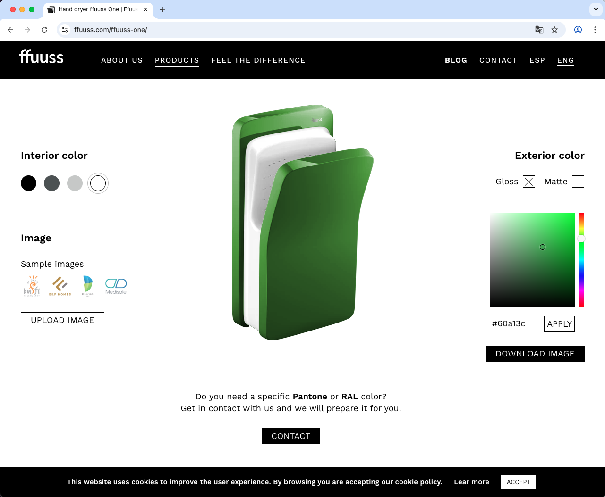
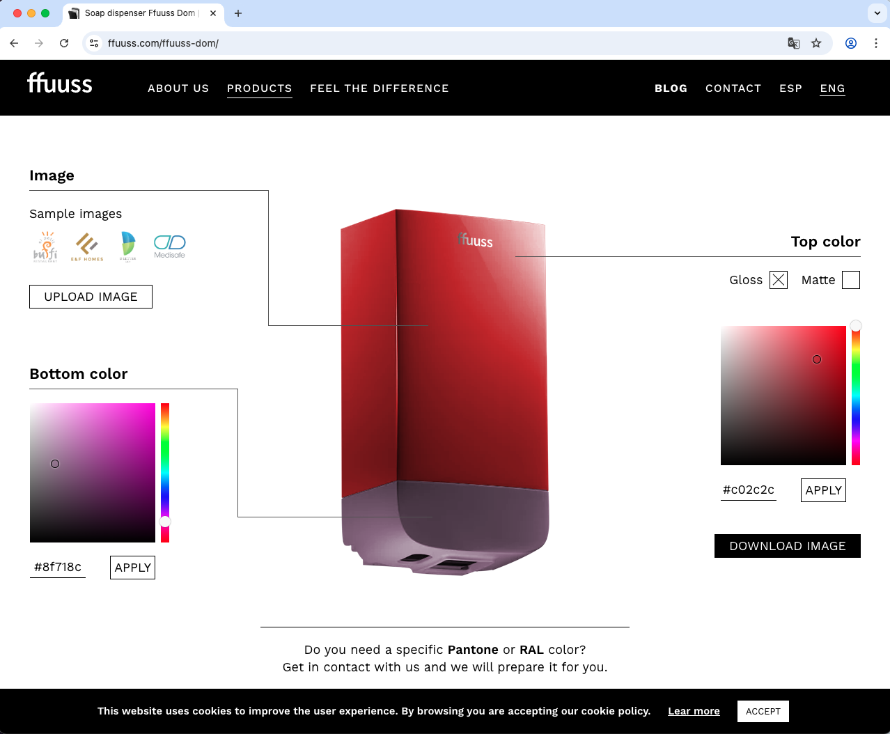
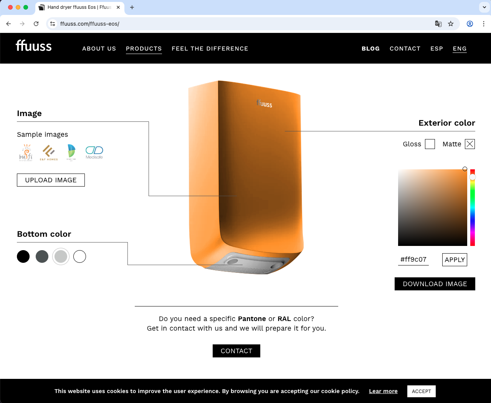

# 💨 Customizador de Secadores de Manos FFUUSS

Configurador visual interactivo desarrollado para [FFUUSS](https://ffuuss.com). Este proyecto permite personalizar visualmente tres modelos de secadores modificando colores, aplicando acabados brillo o mate, y añadiendo una imagen personalizada sobre el producto.

Este proyecto fue originalmente desarrollado como **shortcode de WordPress** y se ha adaptado para ejecutarse como módulo independiente.

🔁 También disponible en [English 🇬🇧](README.md)

---

## 🔗 Proyecto en producción

Integrado oficialmente en la web de FFUUSS:

👉 [https://ffuuss.com/ffuuss-one/](https://ffuuss.com/ffuuss-one/)

---

## 🧪 Demos independientes

Puedes probar el proyecto de forma aislada cambiando el parámetro `ffuusstype`:

- FFUUSS One: [Demo](https://zeliuk.xyz/doityourself-handdryer-customizer/?ffuusstype=one)  
- FFUUSS Dom: [Demo](https://zeliuk.xyz/doityourself-handdryer-customizer/?ffuusstype=dom)  
- FFUUSS Eos: [Demo](https://zeliuk.xyz/doityourself-handdryer-customizer/?ffuusstype=eos)

---

## 🖼️ Capturas de pantalla

### Modelo FFUUSS One


### Modelo FFUUSS Dom


### Modelo FFUUSS Eos


---

## ⚙️ Tecnologías utilizadas

- **PHP**: Generación dinámica de la estructura HTML mediante parámetros GET (`ffuusstype`, `color`, `matte`, etc.).
- **jQuery**: Controla la interactividad, selección de color, carga de imágenes y transiciones.
- **Spectrum.js**: Selector de color RGB avanzado.
- **SCSS**: Estilos modulares y responsivos con máscaras, capas y transformaciones específicas según el modelo.

---

## 🗂️ Estructura del proyecto

```plaintext
/
├── index.php                    # Lógica PHP principal y renderizado HTML
├── js/
│   └── custom.js               # Comportamiento interactivo con jQuery
├── css/
│   ├── custom.scss             # Estilos fuente en SCSS
│   └── spectrum.min.css       # Hoja de estilos del selector de color
├── doityourself/               # Recursos por modelo (imágenes, máscaras, logos)
│   ├── one/
│   ├── dom/
│   └── eos/
└── screenshots/                # Carpeta sugerida para capturas
```

---

## 👨‍💻 Autor

Desarrollado por [Helefante](https://helefante.com)  
Proyecto para [FFUUSS](https://ffuuss.com)

---

## 📄 Licencia

Este proyecto se presenta con fines demostrativos y de portafolio.  
Para su uso comercial, contacta con el desarrollador o con FFUUSS directamente.
