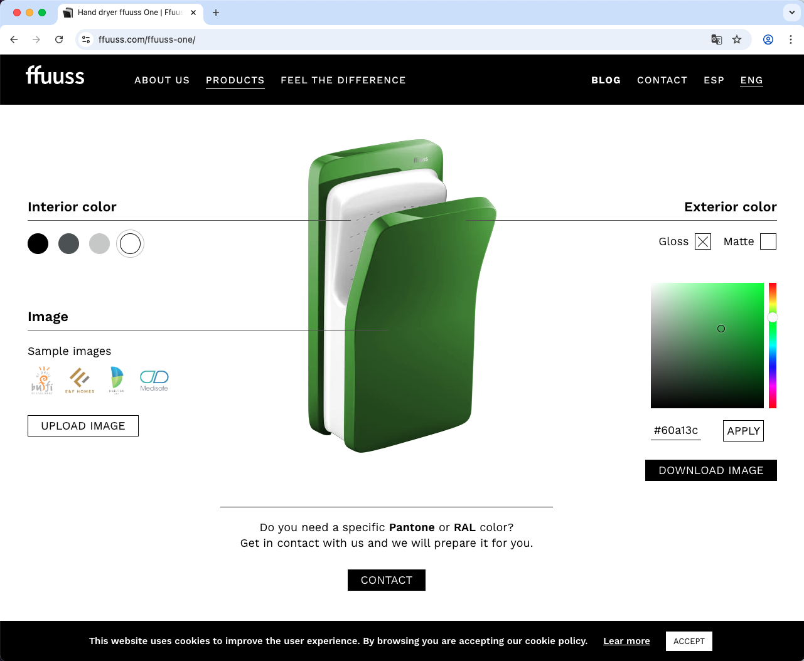

# 💨 FFUUSS Hand Dryer Customizer

A visual configurator for hand dryers developed for <a href="https://ffuuss.com" target="_blank">FFUUSS</a>. This interactive project allows users to customize three different hand dryer models by changing colors, applying matte or gloss finishes, and adding custom overlay images.

Originally built as a **WordPress shortcode**, it has been adapted to run as a standalone front-end module.

🔁 Also available in [Spanish 🇪🇸](README.es.md)

---

## 🔗 Live Project

Officially embedded in the FFUUSS website:

👉 <a href="https://ffuuss.com/ffuuss-one/" target="_blank">https://ffuuss.com/ffuuss-one/</a>

---

## 🧪 Standalone Demos

Try the configurator in standalone mode by changing the `ffuusstype` parameter:

- <a href="https://zeliuk.xyz/doityourself-handdryer-customizer/?ffuusstype=one" target="_blank">FFUUSS One</a>
- <a href="https://zeliuk.xyz/doityourself-handdryer-customizer/?ffuusstype=dom" target="_blank">FFUUSS Dom</a>
- <a href="https://zeliuk.xyz/doityourself-handdryer-customizer/?ffuusstype=eos" target="_blank">FFUUSS Eos</a>

---

## 🖼️ Screenshots

### FFUUSS One


### FFUUSS Dom


### FFUUSS Eos


---

## ⚙️ Technologies Used

- **PHP**: Renders the main HTML structure dynamically based on GET parameters (`ffuusstype`, `color`, `matte`, etc.).
- **jQuery**: Handles interactivity, color palette selection, image injection, and visual transitions.
- **Spectrum.js**: Powerful color picker with full RGB support.
- **SCSS**: Modular responsive styles with masking, layering, and rotation/skewing logic based on dryer type.

---

## 🗂️ Project Structure

```plaintext
/
├── index.php                    # Main PHP logic and HTML rendering
├── js/
│   └── custom.js               # Custom jQuery behavior
├── css/
│   ├── custom.scss             # Source SCSS styles
│   └── spectrum.min.css       # External color picker stylesheet
├── doityourself/               # Assets per model (images, masks, logos)
│   ├── one/
│   ├── dom/
│   └── eos/
└── screenshots/                # Recommended folder for screenshots
```

---

## 👨‍💻 Author

Developed as part of my work at Helefante  
Project for <a href="https://ffuuss.com" target="_blank">FFUUSS</a>

---

## 📄 License

This project is intended for demonstration and portfolio purposes only.  
For commercial usage, please contact the developer or FFUUSS directly.
